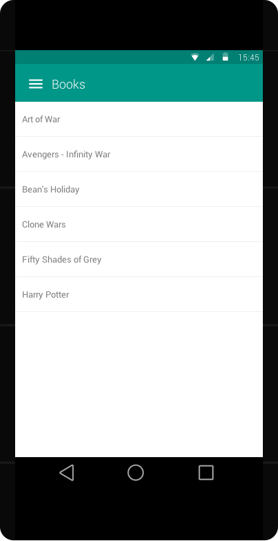
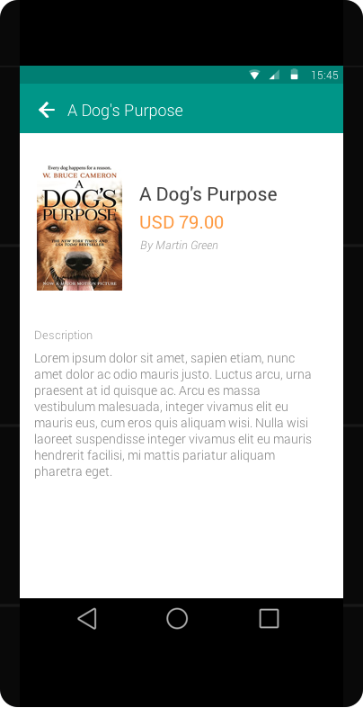

[Home](../../README.md)

# Book Screen

- Use ``RecyclerView`` instead of ``ListView``
- The list must be sorted alphabetically
- Clicking the list item will proceed to the book's detail screen
- API ``/api/books`` will return a ``cover_image_url`` field, use this field to display the book's cover image
as shown in the design below

## Book List

## Book Detail
