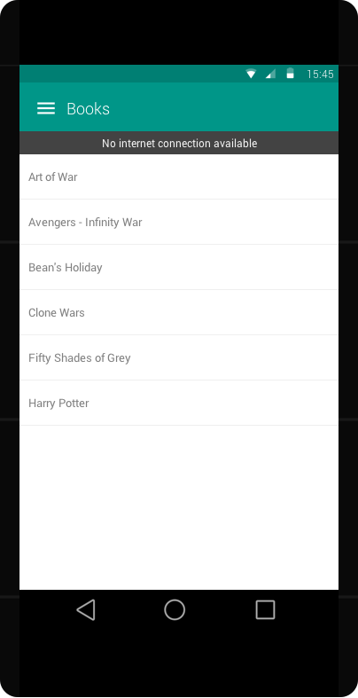

[Home](../../README.md)

# General

## No Internet Connection
When there is no internet connection available, the application should automatically display a banner
between the Toolbar and the screen content. Likewise, when the internet is available, the banner will disappear automatically

Note: The banner MUST appear in every screen

