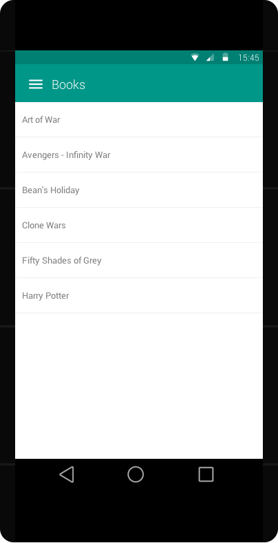
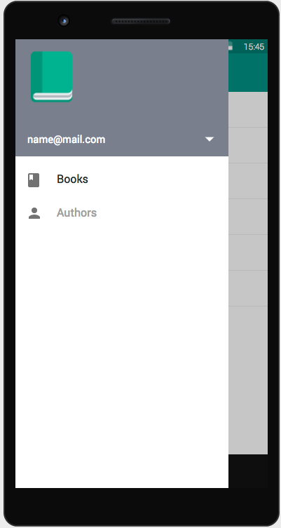

[Home](../../README.md)

# Main Screen

- Contains a navigation drawer at the left side
- Selecting drawer menu will replace the Main screen's content without starting a new ``Activity``
- Clicking ``Books`` will proceed to [book listing screen](books.md)
- Clicking ``Authors`` will proceed to [author listing screen](authors.md)

## Zero State

## With Drawer opened

