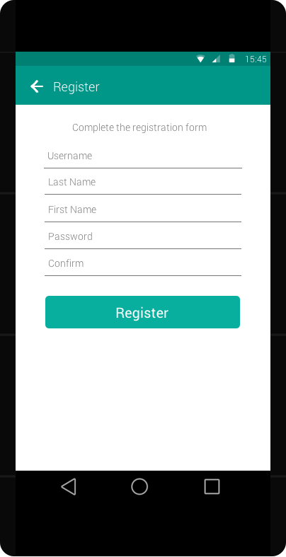

[Home](../../README.md)

# Register Screen

- Both username and password must be validated against emptiness
- Password must be encrypted with MD5 before sending to the server
- Clicking ``Register`` button will send a ``/api/register`` request to the server
- Upon successful registration, proceed to the [Main screen](main.md)

