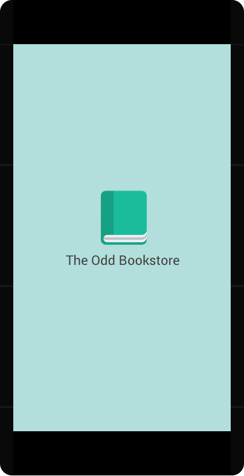

[Home](../../README.md)

# Splash Screen

- This is the first screen user should see when the app is launched
- Make it delay 3 seconds before proceeding to the next screen
- If user never login before, proceed to [Login screen](login.md), otherwise proceed to [Main screen](main.md)

